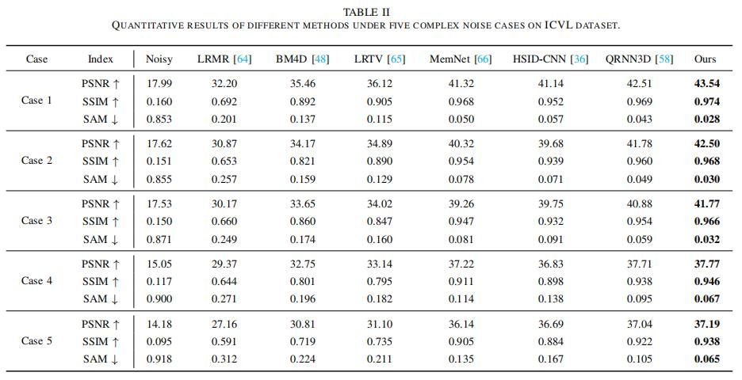
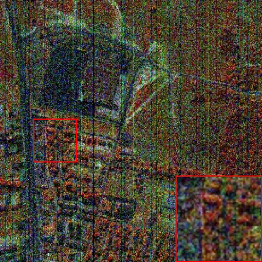
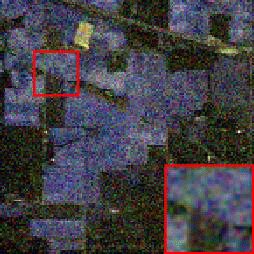

# MAFNet

The implementation of IEEE JSTARS 2023 paper "[Multi-scale Adaptive Fusion Network for Hyperspectral Image Denoising](https://ieeexplore.ieee.org/document/10078381)"


## Results

*  **Comparison of Quantitative Indicators**



*  **Comparison of Visual Quality** 

       


## Configuration
* Python =3.6.8, PyTorch = 1.9.0
* Requirements:  listed in ```requirements.txt```
* Platforms: Ubuntu 16.04.7 LTS x86_64, cuda-10.2


## Quick Start

### 1. Prepare training/testing datasets

#### Training dataset

+ Download [ICVL](https://icvl.cs.bgu.ac.il/hyperspectral/) hyperspectral image database

* Put the downloaded .mat file under the ```data/Mat_icvl```, and it will be cropped with the specified step size to obtain training and  validation dataset under the ```dataset_p_icvl```.
* The operation method of other data sets is the same as above

#### Testing dataset

* Put the test data under the  ```data/test``` path, read and modify the  ```test.py``` file for model testing.


### 2. Testing with pretrained models

* The trained model will be stored in the  ```model``` path.

* \[Gaussian noise removal\]:  
```python3 test.py -pm './model/MAFNet_icvl_guass.pkl' -m 'MAFNet' -b 'no'-n 50 ```

* \[Complex noise removal\]:  
```python3 test.py -pm './model/MAFNet_icvl_case.pkl' -m 'MAFNet' -b 'case5' ```

### 3. Training with incremental learning policy

* Training a blind Gaussian model firstly by  
```python3 main.py -d './data/dataset_p_icvl/' -mp './data/Mat_icvl/' -m 'MAFNet' -e 150 -b 'guass' -c 0 -dn 'icvl'```

* Using the pretrained Gaussian model as initialization to train a complex model:  
```python3 main.py -d './data/dataset_p_icvl/' -mp './data/Mat_icvl/' -m 'MAFNet' -e 150 -b 'case5' -pm './model/MAFNet_icvl_guass.pkl' -c 0 -dn 'icvl'```

## Citation
If you find this work useful for your research, please cite: 
```bibtex
@ARTICLE{mafnet23jstars,
  author={Pan, Haodong and Gao, Feng and Dong, Junyu and Du, Qian},
  journal={IEEE Journal of Selected Topics in Applied Earth Observations and Remote Sensing}, 
  title={Multi-Scale Adaptive Fusion Network for Hyperspectral Image Denoising}, 
  year={2023},
  pages={1-16},
  doi={10.1109/JSTARS.2023.3257051}}
```

## Contact
Please contact me if there is any question ( hyzs1220@outlook.com )  